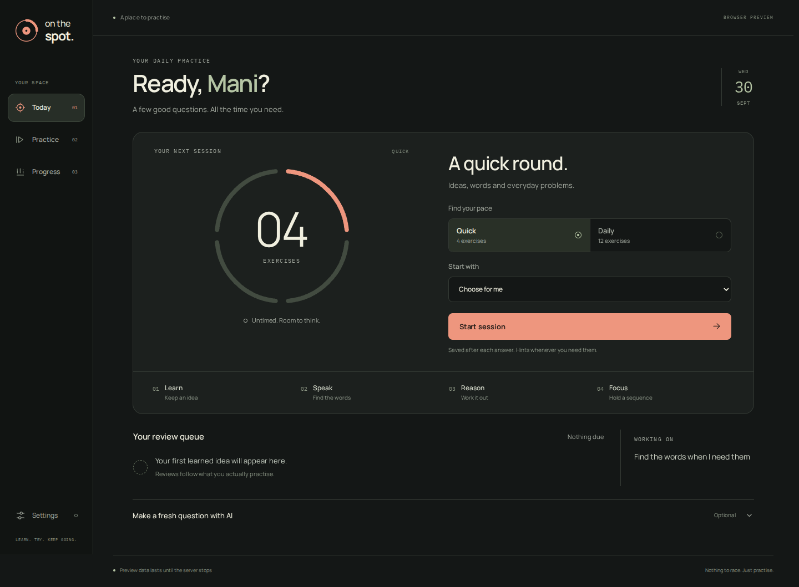

# On the Spot

Personal Windows learning and recall app. Electron, React/TypeScript and local SQLite. Today, Practice and Progress contain the complete local learning loop.

## Practice instrument interface

The source now uses a warm ink, chalk and coral visual system built around a segmented session dial. Today, Practice and Progress share the same shell; the dial becomes the current exercise marker, and settings open beside the current task. Draft answers and disclosure state survive tab changes. Fonts are bundled locally.

See [design decisions and interaction rules](design/README.md). Run `npm run dev` for an isolated browser preview of the actual local learning engine. Preview data stays in temporary server memory, independent of the Windows app. ChatGPT, protected desktop storage and local microphone transcription require the desktop app.



[Practice](design/revamp/practice-desktop.png) · [Progress](design/revamp/progress-desktop.png) · [Settings](design/revamp/settings-desktop.png) · [Mobile](design/revamp/today-mobile.png) · [Motion walkthrough](design/revamp/walkthrough.mp4)

The downloads below are the existing **v0.2.1 release**. Build the updated source to use the new interface; this source change does not replace published installers.

## Complete app downloads

- [Windows installer — complete app with offline voice](https://github.com/Roronoa-code/On-the-Spot/releases/download/v0.2.1/On-the-Spot-Setup-0.2.1.exe)
- [Portable Windows app — extract and run](https://github.com/Roronoa-code/On-the-Spot/releases/download/v0.2.1/On-the-Spot-Portable-Windows-0.2.1.zip)
- [Complete project — source, compiled frontend, tests, UI preview and speech files](https://github.com/Roronoa-code/On-the-Spot/releases/download/v0.2.1/On-the-Spot-Complete-Project-0.2.1.zip)
- [Speech runtime for repository clones](https://github.com/Roronoa-code/On-the-Spot/releases/download/v0.2.1/On-the-Spot-Voice-Runtime-0.2.1.zip)
- [SHA-256 checksums](https://github.com/Roronoa-code/On-the-Spot/releases/download/v0.2.1/SHA256SUMS.txt)

The complete application files are attached to the [public release](https://github.com/Roronoa-code/On-the-Spot/releases/tag/v0.2.1). The Git repository contains the source and build configuration; the large app and speech files are release downloads.

## Install and use

Download **On-the-Spot-Setup-0.2.1.exe** from the [GitHub release](https://github.com/Roronoa-code/On-the-Spot/releases/tag/v0.2.1) and run it on 64-bit Windows. This is the complete app, including the offline speech model and recognition runtime. No separate speech download or API key is needed to use the installed app. The installer is unsigned. Updates and uninstall preserve learner and account data.

1. Fill in your interests, goal and preferred language. Edit them later in Progress.
2. In Today, choose Quick or Daily and optionally a topic. Teaching comes before unfamiliar material and prerequisites.
3. Type or choose Speak answer. Allow the microphone when asked. Stop and transcribe, then edit the text before checking your answer. Teach me, Give a hint and Skip are available.
4. Finish for a summary and optional conversation task. Close and reopen to continue a session or see your next review.

Sessions are untimed. Durations are approximate: four exercises for a short session, twelve for a daily session. Reviewed topics include everyday planning, vocabulary, a Spanish greeting and optional beginner programming. Starter explanations are in English. Preferred language is saved and used in optional AI feedback; the complete local content set is not translated.

## Optional ChatGPT plan connection

Open Settings, choose Continue with ChatGPT and sign in in your system browser. Use the account whose plan you want to use. This does not import conversations or memories. Set a weekly app cap in Manage usage and keep credit spending off.

The requested preference is **GPT 6 Luna at max reasoning**, with **GPT 5.6 Luna at max** only on a model-availability error. Usage limits and network failures never trigger that fallback. GPT 6 Luna at max passed an authenticated response, grounded lesson generation and provisional-feedback check on 30 September 2026; no fallback was needed. The catalog can omit a model that direct inference accepts; the saved preference can still be tested directly.

Optional AI variations send a reviewed passage, your interests, goal and preferred language. Review and keep or discard the question before use. Feedback sends the exercise, reference/rubric, answer and language. AI feedback remains unscored until you confirm or correct it. Requests use `store:false`; this is not a guarantee of zero provider retention.

ChatGPT Voice is not exposed through the supported plan connection: audio input and transcription are excluded. The app uses local recognition and Windows offline speech. API-key voice would be separately billed and is not implemented.

Check app-usage attribution in ChatGPT settings: an enabled app limit is not usage evidence.

## Learning rules

Unknown concepts are taught and need a comprehension check before spaced review. Learned concepts use ts-fsrs default parameters. Misses bring reviews forward; repeated errors return to prerequisites. Missing, skipped, unclear and disputed answers do not count as forgetting. Labels and results are correctable in Progress.

Reasoning and attention have separate levels. Three unaided successes at the same level raise difficulty; two misses lower it. Progress compares the same task type and level, showing first/latest examples. These are task results, not health, brain-age or intelligence scores. Due-first ordering and maximum new concepts are configurable. Fluid navigation moves the selected rail surface from its current position, with a shared session ring between views. Gentle and OS reduced motion are available in Settings. Feedback uses the approved soft, letter-by-letter reveal. Stop reveal retains the visible text and its reserved layout space with an Interrupted marker; Show all reveals the complete validated result. This is a presentation animation after validation, not partial AI output.

Arithmetic, estimation, practical constraints and sequences have local, checkable answers. Open explanations use a provisional word rubric, including partial coverage. Alternate valid wording can be corrected. Generated code is never executed.

## Local voice and privacy

Bundled: official whisper.cpp v1.8.3 CPU binaries and multilingual Whisper base model. A sample benchmark on this PC took about 1.8 seconds. Detection and nine explicit speech languages are available. Text-to-speech uses Windows voices marked local; install a suitable Windows voice if none is available.

Microphone use requires explicit consent. Audio stays in memory during capture and in a unique temporary directory during local transcription. It is deleted on success, failure or cancellation. Correct the transcript before grading. Silence and malformed audio are rejected. Local response timing excludes transcription processing; onset uses an amplitude threshold and is not diagnostic.

App data: `%APPDATA%\On the Spot`. Account credentials use DPAPI through Electron safeStorage and atomic writes. SQLite stores the learner profile, versioned exercises, prerequisites, answers and schedules in a DPAPI-protected record. Export creates readable JSON at your chosen location. Delete learner data asks for confirmation and removes learner records; connections and exported files are retained. Encryption does not defeat all same-user software.

The renderer has no Node integration or general network access. Context isolation, sandboxing, restrictive CSP and validated IPC allowlists are enabled. OAuth uses fresh state, nonce and PKCE, signed identity verification, separate registrations, serial renewal and renewable-session revocation on sign-out.

## Build and checks

Node.js 24 or newer and 64-bit Windows:

```powershell
npm ci
# For local speech or packaging, extract the voice-runtime folder from
# On-the-Spot-Voice-Runtime-0.2.1.zip into this project first.
npm start
npm run check
npm run package
```

Dependencies are locked in package-lock.json. Source is in src and electron; installers are generated in release. Account data, local build output, private verification artifacts and speech binaries are excluded from this repository.

The [GitHub release](https://github.com/Roronoa-code/On-the-Spot/releases/tag/v0.2.1) also includes **On-the-Spot-Voice-Runtime-0.2.1.zip** for building the complete app from source. Extract its `voice-runtime` folder into the project root. Release assets have SHA-256 checksums in `SHA256SUMS.txt`.

Alternatively, download the Windows x64 CPU archive from the [whisper.cpp v1.8.3 release](https://github.com/ggml-org/whisper.cpp/releases/tag/v1.8.3). Extract its `Release` folder into `voice-runtime/Release`. Download [ggml-base.bin](https://huggingface.co/ggerganov/whisper.cpp/resolve/main/ggml-base.bin) into `voice-runtime/ggml-base.bin`. Verify both downloads against the SHA-256 hashes in THIRD-PARTY-NOTICES.txt. Typing and offline learning work without these speech files.

The earlier layout comparison remains in `design/layout-preview.html` as a historical concept. The implemented redesign is in `src`, with its decisions in `design/README.md`. Use `npm run dev` to try the actual learning UI with separate temporary preview data.

Browser verification of the actual local learning flow (requires an installed Playwright browser):

```sh
npm install --no-save playwright
npx playwright install chromium
npm run test:ui
npm run test:voice
npm run test:renderer
```

The browser test starts its own loopback preview, completes a session using the real learning engine, checks responsive layouts and preserves screenshots in `artifacts/ui`. `OTS_BROWSER_EXECUTABLE` can point to an existing Chromium executable. These checks do not verify Windows encryption, account sign-in, physical audio or a packaged installer.

The voice test uses explicit microphone, transcription and voice fixtures to check lifecycle races and native prompt layout. The renderer test builds the production bundle and exercises it under its original CSP, with the real learning engine supplied through a test binding. To add automated accessibility scans, install `axe-core` and set `OTS_AXE_SOURCE` to `node_modules/axe-core/axe.min.js` when running `test:ui`.

Optional hidden desktop verification with an available Playwright install:

```powershell
$env:PLAYWRIGHT_MODULE = 'C:\path\to\node_modules\playwright'
node tests/desktop-smoke.cjs
node tests/dialog-smoke.cjs
# Set OTS_EXECUTABLE to the installed On the Spot.exe for a packaged check.
```

Node checks cover OAuth/stream failures, usage limits, malformed schemas, injection/factual guards, restricted fallback, deterministic grading, recovery, duplicate prevention, correction, prerequisite ordering, scheduling and voice validation. Desktop checks complete an offline session and reopen it, verify protected bytes/process isolation, and capture screens/exercises at 1080/650/390 widths. Hidden checks do not use the real mouse or keyboard. Physical microphone and offline speech audition still require user verification.

## Official contracts

- [Plan sign-in](https://developers.openai.com/siwc/token-sharing-open-source/sign-in)
- [Inference limitations](https://developers.openai.com/siwc/token-sharing-open-source/preview-limitations)
- [Renewal and revocation](https://developers.openai.com/siwc/token-sharing-open-source/profiles-and-sessions)
- [whisper.cpp](https://github.com/ggml-org/whisper.cpp)
- [ts-fsrs](https://github.com/open-spaced-repetition/ts-fsrs)


